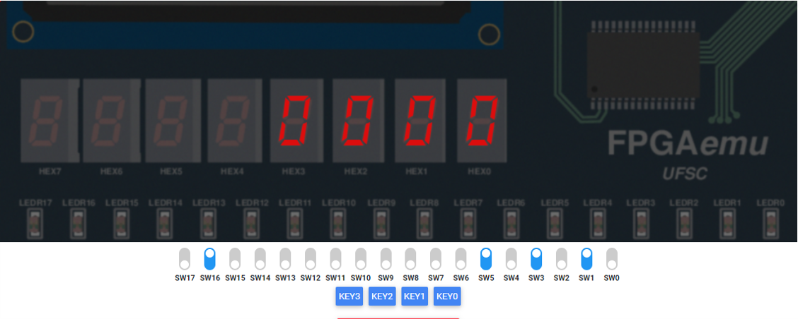
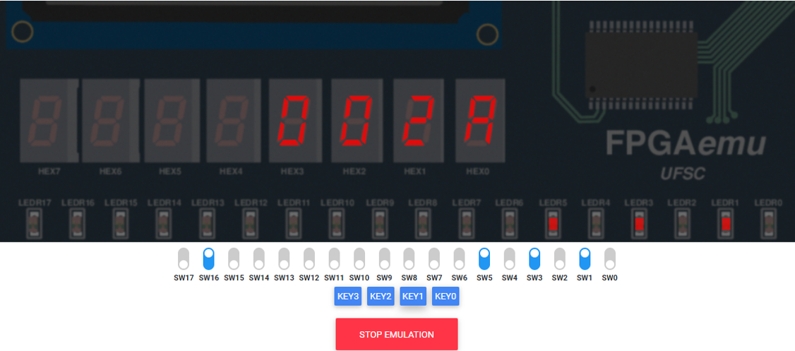
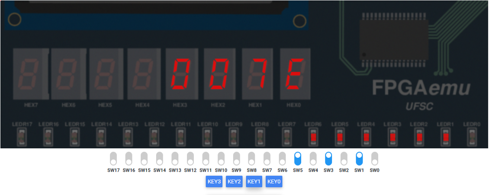
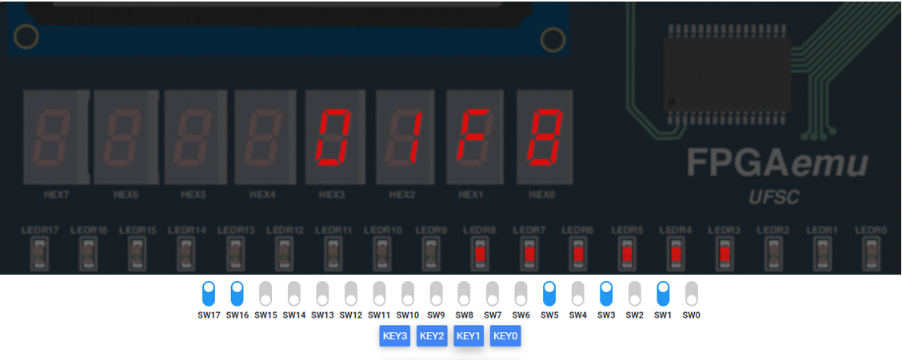
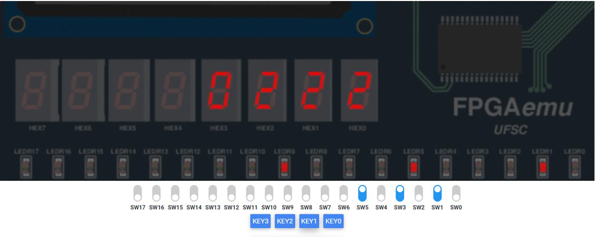

Capítulo 9: VHDL

# Relatório capítulo 9: VHDL

**Aluno**: Alexandre Hoffmann Genthner
**Matrícula:** 16103372

---

 * Diagrama de estados do circuito:


<center>


</center>


 * Resultado final da simulação do arquivo `multi_modo.vhd`, passando por 6 estados tendo como valor de teste `mmIn = 42`: 


## Simulação na plataforma _online_

Para o valor de 42 na entrada, deve-se esperar os seguintes valores na emulação:

<center>

|operação|SW(17 *downto* 16)|**Decimal**|**Hexadecimal**|
|---:|:---:|:---:|:---:|
|-|`01`|42|`0x2A`|
| $R_2\leftarrow R_1 \ll 1$ |`11`|84|`0x54`|
| $R_3 \leftarrow R_2 + R_1$ |`00`|126|`0x7E`|
| $R_6\leftarrow R_3 \ll 1$ |`11`|252|`0xFC`|
| $R_12\leftarrow R_6 \ll 1$ |`11`|504|`0x1F8`|
| $R_{13} \leftarrow R_{12} + R_1$ |`00`|546|`0x222`|

</center>


> valor inicial apresentado pela placa antes da seleção de `KEY1`


> saída `0x2A` após execução de um ciclo de *clock* pela chave `KEY1`. Resultado como previsto. 
> 

> saída `0x54` após execução de um ciclo de *clock* pela chave `KEY1`. Resultado como previsto. 


> saída `0x7E` após execução de um ciclo de *clock* pela chave `KEY1`. Resultado como previsto. 


> saída `0xFC` após execução de um ciclo de *clock* pela chave `KEY1`. Resultado como previsto. 


> saída `0x1F8` após execução de um ciclo de *clock* pela chave `KEY1`. Resultado como previsto. 


> saída `0x222` após execução de um ciclo de *clock* pela chave `KEY1`. Resultado como previsto. 


# Arquivos VHDL
## multi_modo.vhd

```vhdl
library IEEE;
use IEEE.STD_LOGIC_1164.all;

entity multi_modo is
	port(
    mmCLK, mmRST, mmENA: in std_logic;
    mmSelect: in std_logic_vector(1 downto 0);
    mmIn: in std_logic_vector(15 downto 0);
    mmOut: out std_logic_vector(15 downto 0)
	 );
end multi_modo;

architecture Structural of multi_modo is

  signal mm_muxA, mm_muxB, mm_muxC, mm_muxD : std_logic_vector(15 downto 0);
  signal mm_registerIn : std_logic_vector(15 downto 0);
  signal mmPreOut : std_logic_vector(15 downto 0);

  component adder_16 is
    port(
      operand_a, operand_b: in std_logic_vector(15 downto 0);
      result: out std_logic_vector(15 downto 0)
    );
  end component;

  component shiftL is
    port(
      sllIn: in std_logic_vector (15 downto 0);
      sllOut: out std_logic_vector (15 downto 0)
    );
  end component;

  component shiftR is
    port(
      srlIn: in std_logic_vector (15 downto 0);
      srlOut: out std_logic_vector (15 downto 0)
    );
  end component;

  component mux_4_1 is
    port(
      A: in std_logic_vector (15 downto 0);
      B: in std_logic_vector (15 downto 0);
      C: in std_logic_vector (15 downto 0);
      D: in std_logic_vector (15 downto 0);
      s: in std_logic_vector(1 downto 0);
      F: out std_logic_vector (15 downto 0)
    );
  end component;

  component regis is
    port(
      registerENA: in std_logic;
      registerRST: in std_logic;
      registerCLK: in std_logic;
      registerIn: in std_logic_vector (15 downto 0);
      registerOut: out std_logic_vector (15 downto 0)
    );
  end component;

  begin

    mm_muxB <= mmIn;

		U00: adder_16 port map( operand_a => mmIn ,
                            	operand_b => mmPreOut ,
                            	result => mm_muxA);
    	U01: shiftR port map(srlIn => mmPreOut, srlOut => mm_muxC);
    	U02: shiftL port map(sllIn => mmPreOut, sllOut => mm_muxD);
    	U03: mux_4_1 port map(  A => mm_muxA ,
                            	B => mm_muxB ,
                            	C => mm_muxC ,
                            	D => mm_muxD ,
                            	s => mmSelect,
                            	F => mm_registerIn );
    	U04: regis port map(    registerENA => mmENA,
                            	registerRST => mmRST,
                            	registerCLK => mmCLK,
                            	registerIn => mm_registerIn,
                            	registerOut => mmPreOut);

    mmOut <= mmPreOut;
end Structural;
```

## shiftL.vhd

```vhdl
library IEEE;
use IEEE.Std_Logic_1164.all;

entity shiftL is
  port (
    sllIn: in std_logic_vector (15 downto 0);
    sllOut: out std_logic_vector (15 downto 0)
    );
  end shiftL;

architecture behavior of shiftL is

  signal auxSignal: std_logic_vector(14 downto 0);

  begin
    auxSignal <= sllIn(14 downto 0);
    sllOut <= auxSignal & '0';
end behavior;

```

## shiftR

```vhdl
library IEEE;
use IEEE.Std_Logic_1164.all;

entity shiftR is
  port (
    srlIn: in std_logic_vector (15 downto 0);
    srlOut: out std_logic_vector (15 downto 0)
    );
  end shiftR;

architecture behavior of shiftR is

  signal auxSignal: std_logic_vector(14 downto 0);

  begin
    auxSignal <= srlIn(15 downto 1);
    srlOut <= '0' & auxSignal;
end behavior;

```

## mux_4_1.vhd

```vhdl
-- Multiplexador 4.1

library IEEE;
use IEEE.Std_Logic_1164.all;

entity mux_4_1 is
  port (A: in std_logic_vector (15 downto 0);
    	B: in std_logic_vector (15 downto 0);
    	C: in std_logic_vector (15 downto 0);
    	D: in std_logic_vector (15 downto 0);
    	s: in std_logic_vector(1 downto 0);
    	F: out std_logic_vector (15 downto 0)
    	);
  end mux_4_1;

 -- ARQUITETURA ESTRUTURAL
architecture mux_estr of mux_4_1 is

  begin
    F <=  A when s = "00" else
          B when s = "01" else
          C when s = "10" else
          D;
end mux_estr;

```

## regis.vhd

```vhdl
-- register for a 16 bits signals

library IEEE;
use IEEE.Std_Logic_1164.all;

entity regis is
  port (
    registerENA: in std_logic;
    registerRST: in std_logic;
    registerCLK: in std_logic;
    registerIn: in std_logic_vector (15 downto 0);
    registerOut: out std_logic_vector (15 downto 0)
    );
  end regis;

architecture behavior of regis is

  begin
    process
      begin
      wait until registerCLK'event and registerCLK = '1';

      if registerRST = '1' then
        registerOut <= "0000000000000000";
      elsif registerENA = '1' then
        registerOut <= registerIn;
      end if;
    end process;
end behavior;

```

## adder_16.vhd

```vhdl
library IEEE;
use IEEE.STD_LOGIC_1164.all;

entity adder_16 is
	port(
    operand_a, operand_b: in std_logic_vector(15 downto 0);
    result: out std_logic_vector(15 downto 0)
	 );
end adder_16;

architecture Structural of adder_16 is

	signal overflow : std_logic;
  signal aux: std_logic_vector(14 downto 0);

  component full_adder is
    port(
      A: in std_logic;
      B: in std_logic;
      Cin: in std_logic;
      S: out std_logic;
      Cout: out std_logic
    );
  end component;

  component half_adder is
    port(
      A: in std_logic;
      B: in std_logic;
      S: out std_logic;
      Cout: out std_logic
     );
   end component;
	 
  begin
		U00: half_adder port map(A => operand_a(0), B=> operand_b(0), S=> result(0), Cout=> aux(0));
    	U01: full_adder port map(A => operand_a(1), B=> operand_b(1), Cin=> aux(0), S=> result(1), Cout=> aux(1));
    	U02: full_adder port map(A => operand_a(2), B=> operand_b(2), Cin=> aux(1), S=> result(2), Cout=> aux(2));
    	U03: full_adder port map(A => operand_a(3), B=> operand_b(3), Cin=> aux(2), S=> result(3), Cout=> aux(3));
    	U04: full_adder port map(A => operand_a(4), B=> operand_b(4), Cin=> aux(3), S=> result(4), Cout=> aux(4));
		U05: full_adder port map(A => operand_a(5), B=> operand_b(5), Cin=> aux(4), S=> result(5), Cout=> aux(5));
    	U06: full_adder port map(A => operand_a(6), B=> operand_b(6), Cin=> aux(5), S=> result(6), Cout=> aux(6));
    	U07: full_adder port map(A => operand_a(7), B=> operand_b(7), Cin=> aux(6), S=> result(7), Cout=> aux(7));
    	U08: full_adder port map(A => operand_a(8), B=> operand_b(8), Cin=> aux(7), S=> result(8), Cout=> aux(8));
		U09: full_adder port map(A => operand_a(9), B=> operand_b(9), Cin=> aux(8), S=> result(9), Cout=> aux(9));
    	U10: full_adder port map(A => operand_a(10), B=> operand_b(10), Cin=> aux(9), S=> result(10), Cout=> aux(10));
    	U11: full_adder port map(A => operand_a(11), B=> operand_b(11), Cin=> aux(10), S=> result(11), Cout=> aux(11));
    	U12: full_adder port map(A => operand_a(12), B=> operand_b(12), Cin=> aux(11), S=> result(12), Cout=> aux(12));
		U13: full_adder port map(A => operand_a(13), B=> operand_b(13), Cin=> aux(12), S=> result(13), Cout=> aux(13));
    	U14: full_adder port map(A => operand_a(14), B=> operand_b(14), Cin=> aux(13), S=> result(14), Cout=> aux(14));
    	U15: full_adder port map(A => operand_a(15), B=> operand_b(15), Cin=> aux(14), S=> result(15), Cout=> overflow);
end Structural;

```